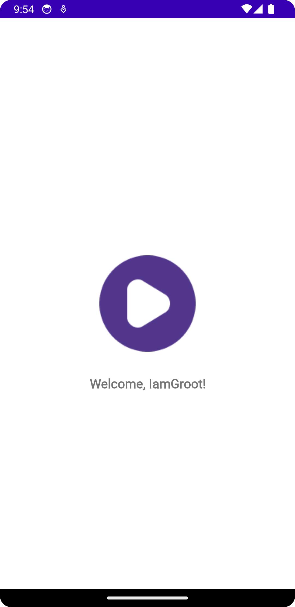

# Shows app

The development of this app is currently in progress within the guidelines of 
the [Infinum Academy android course](https://infinum.academy/courses/android/).

## User interface
### Login

 
    

        
Upon launching the app, the user
            is greeted by the displayed UI
            containing a login form. The login button is initially disabled and gets updated according to every update of the form
        

        

         
         
In the event that the user enters credentials that don't satisfy the criterion for a valid email or password, an error message will be displayed. Additionally a snackbar will appear upon the user entering an invalid email informing the user that the email is invalid.
        

        

         
         
Once the user enters a valid email and password, the login button is enabled
        

        

        
        
        

### Welcome

 
    

        
On successfull login the user is met with a welcome greeting
        

        

    

        

Additional features will be implemented according to further instructions from the academy mentors.
