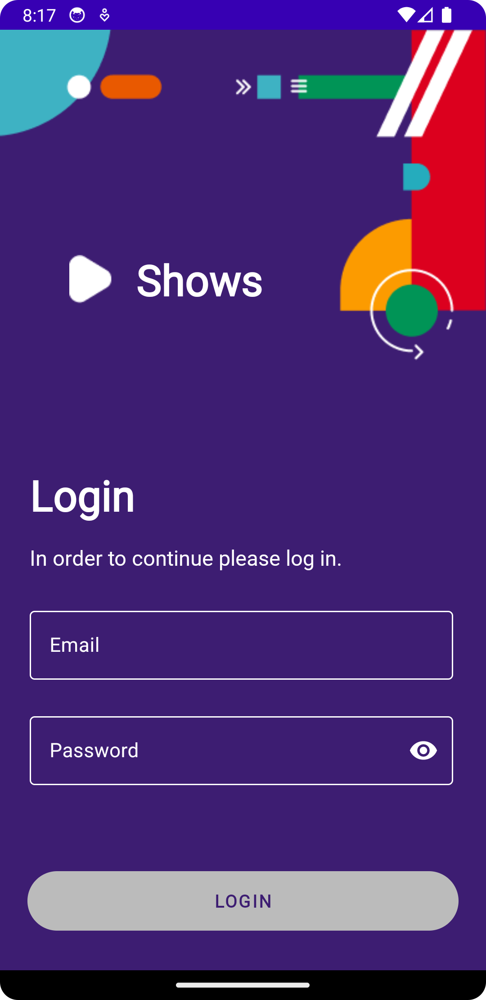
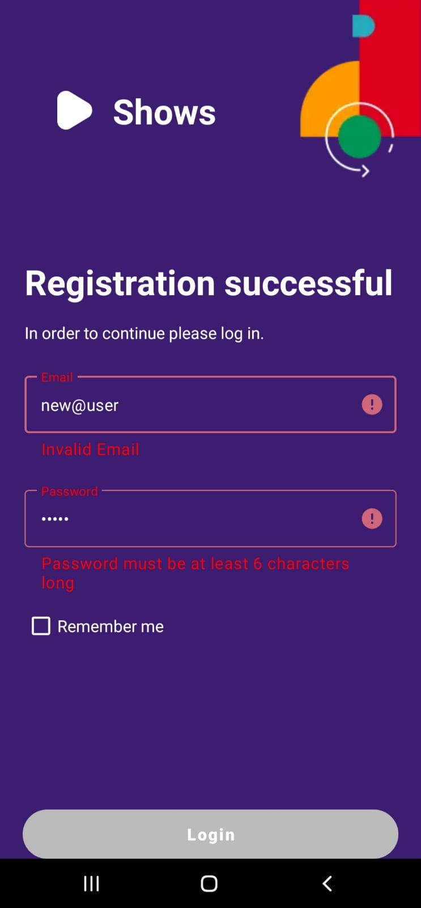
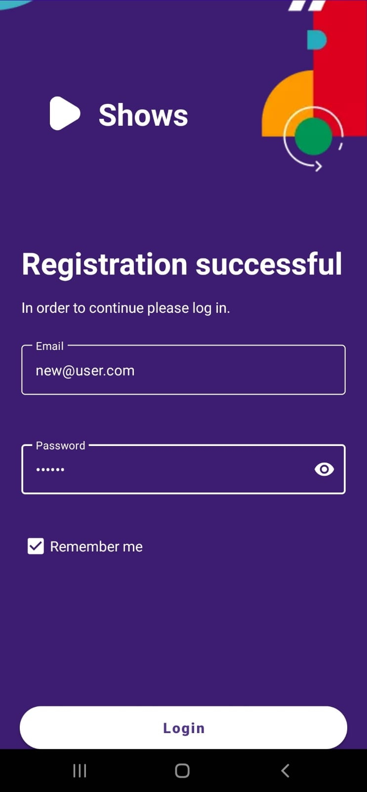
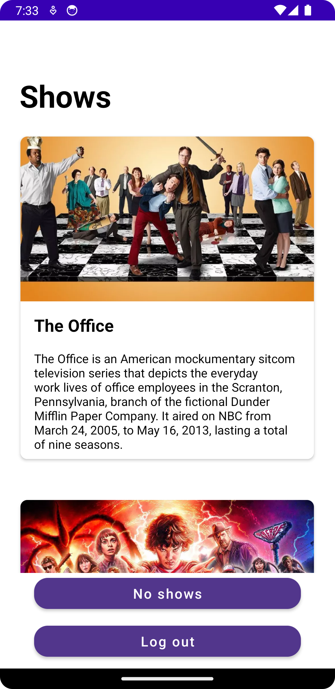
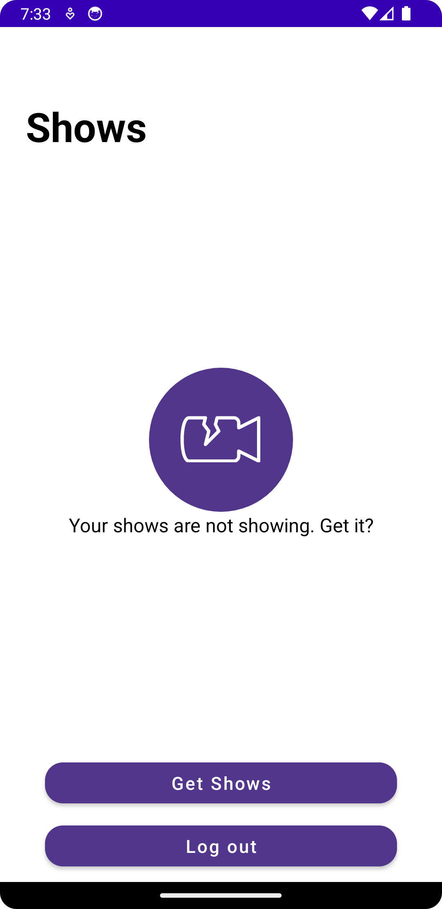
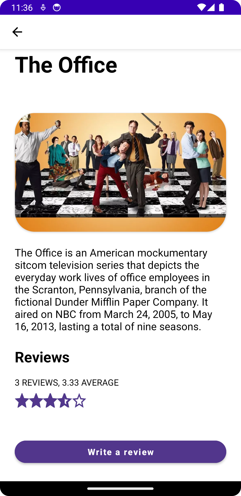
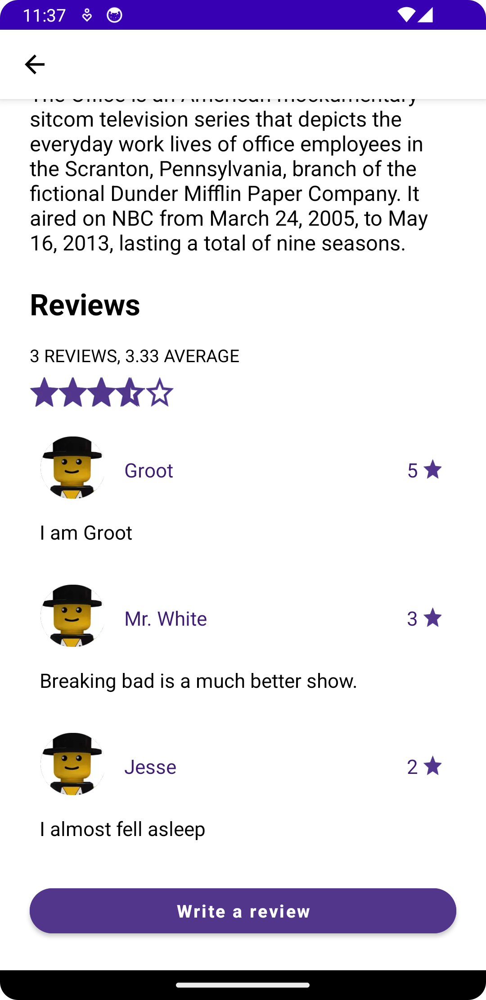
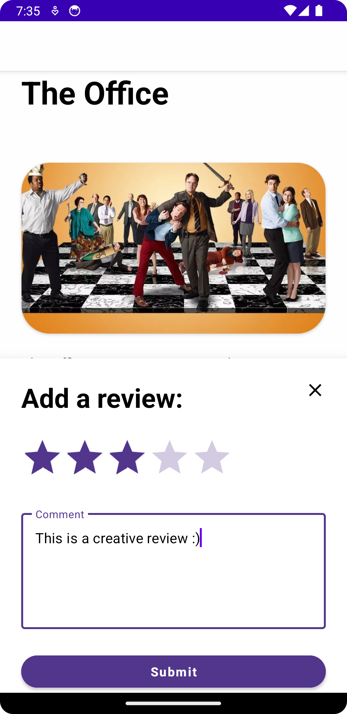

# Shows app

The development of this app is currently in progress within the guidelines of 
the [Infinum Academy android course](https://infinum.academy/courses/android/).

## User interface
### Login

 
    

        
Upon launching the app, the user
            is greeted by the displayed UI
            containing a login form. The login button is initially disabled and gets updated according to every update of the form
        

        

         
         
In the event that the user enters credentials that don't satisfy the criterion for a valid email or password, an error message will be displayed. Additionally a snackbar will appear upon the user entering an invalid email informing the user that the email is invalid.
        

        

         
         
Once the user enters a valid email and password, the login button is enabled
        

        

        
        
        

### Shows

 
    

        
On successful login the user is met with a display of various shows. The user can (for now) navigate to a display that corresponds to a state where there are no shows to be displayed. Also, the user has the ability to log out which will bring the user back to the login screen.
        

        

    

        
        

### Show details

 
    

        
Once the user taps on a show, he is greeted by the display of details for the corresponding show. The details include the title, fitting image, short description, average rating, and reviews. The user also has the ability to add a review. Upon clicking the "Write a review" button, a bottom sheet dialog will appear, prompting the user to add a rating of at least one star and write an optional review.
        

        

    

        
        
        

Additional features will be implemented according to further instructions from the academy mentors.
