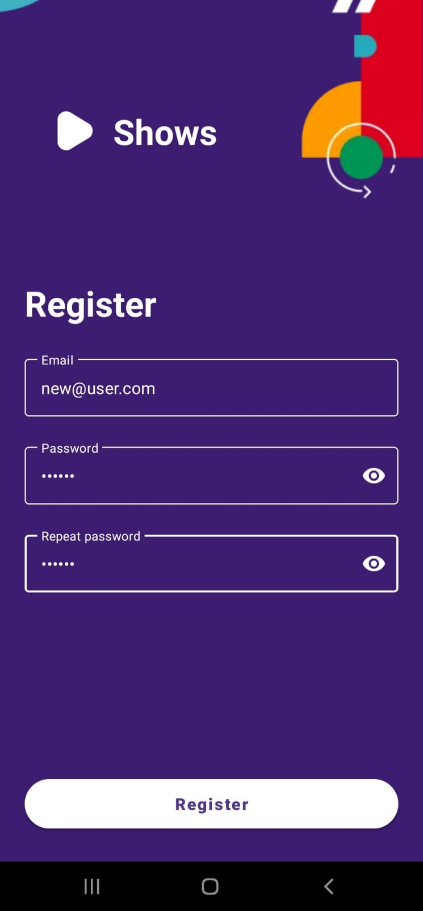

# Shows app

This app was developed during the 2023 [Infinum Academy android course](https://infinum.academy/courses/android/).

## Project details
<ul>
    <li>The target sdk that the project supports is 34 while the minimum sdk is 24</li>
    <li>The used <a href="https://tv-shows.infinum.academy/api/v1/docs/index.html#section/Tv-Show-API">API</a> and corresponding documentation is provided by the academy</li>
    <li>For easier http calls the <a href="https://square.github.io/retrofit/">retrofit</a> client is used</li>
    <li>Locally the data is stored using the <a href="https://developer.android.com/training/data-storage/room">Room</a> library</li>
    <li>Easier image handling is provided by <a href="https://github.com/bumptech/glide">Glide</a></li>
</ul>

## User interface
### Login

 
    

        
Upon launching the app, the user
            is greeted by the displayed UI
            containing a login form. From then the user can either register or log in to an existing account. The login button is initially disabled and gets updated according to every update of the form. The user has the option to choose whether he wants his login to be remembered or not.
        

        

         
         
In the event that the user enters credentials that don't satisfy the criterion for a valid email or password, an error message will be displayed.
        

        

         
         
Once the user enters a valid email and password, the login button is enabled
        

        

        
        
        
        

### Shows

 
    

        
On successful login the user is met with a display of various shows. The shows are fetched from an <a href="https://tv-shows.infinum.academy/api/v1/docs/index.html#section/Tv-Show-API">API</a> if an internet connection is detected. Otherwise, if the shows were previously downloaded upon viewing, they will be loaded from the database. If there is no internet connection and no data in the database then the user will be informed that the shows can not be displayed. Additionally, the user can tap on a chip if he feels like seeing only the top rated shows.
        

        

    

        
        

### User profile

 
    

        
In the right upper corner of the screen the users profile picture is displayed. If the user taps on the profile picture a dialog appears displaying information about the users account. In the dialog the user can log out or change his profile photo. If he wishes to change his profile photo he will be met with an alert dialog prompting him to choose whether he wants to take a new picture or choose one from the gallery.
        

        

    

        
        

### Show details

 
    

        
Once the user taps on a show, he is greeted by the display of details for the corresponding show. The details include the title, fitting image, short description, average rating, and reviews. The user also has the ability to add a review. Upon clicking the "Write a review" button, a bottom sheet dialog will appear, prompting the user to add a rating of at least one star and write an optional review.
        

        

    

        
        
        
        

